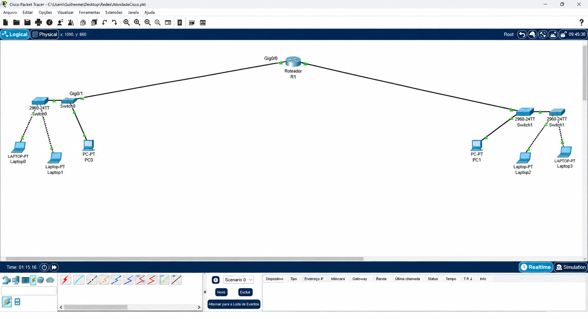

# 🌐 Curso 2: Começando com o Cisco Packet Tracer (Cisco Academy)

Este documento registra a conclusão oficial dos estudos práticos de fundamentos de redes e a aplicação da topologia de arquitetura de conectividade.

---

## 🛠️ Laboratório Prático: Engenharia de Redes e Conectividade Segura

**Analista responsável:** Michael Hernandes Rodrigues  
**Ambiente Utilizado:** Cisco Packet Tracer  
**Escopo do Projeto:** Simulação de Infraestrutura de Rede Corporativa com Roteamento e Switches em Cascata por Setores  

> 📌 **Contexto Acadêmico:** Este projeto prático foi desenvolvido no âmbito de simulação de laboratório para correlacionar conceitos de sub-redes, roteamento de gateways e arquitetura de switches à minha graduação em Segurança da Informação na **Faculdade de Tecnologia Prof. José Arana Varela (Araraquara)**.

---

## 🗺️ 1.0 Arquitetura da Topologia Física

A topologia simulada reproduz o cenário de uma infraestrutura corporativa dividida em dois segmentos de rede principais, interconectados por um nó central de roteamento de borda e distribuídos por switches em cascata para expansão de endpoints:



* **Ativo de Borda / Roteamento:** 1 Roteador Central (**R1**), atuando como o núcleo de encaminhamento de pacotes e isolamento de gateways entre as sub-redes.
* **Ativos de Distribuição (Lado Esquerdo):** 2 Switches Cisco Catalyst 2960 (**Switch0** e **Swtob0**) conectados em cascata para gerenciar o enlace de dados e expandir as portas locais.
* **Ativos de Distribuição (Lado Direito):** 2 Switches Cisco Catalyst 2960 de portas FastEthernet empilhados/conectados em cascata para atendimento do segundo setor.
* **Dispositivos Finais (Endpoints):** 6 Estações de trabalho fixas totalmente cabeadas, divididas entre Computadores (PC0 e PC1) e Laptops (Laptop 0, 1, 2 e 3).

---

## ⚙️ 2.0 Detalhes do Endereçamento Lógico e Configuração

O Roteador R1 atua como o gateway padrão de ambos os domínios de broadcast, dividindo o tráfego de forma limpa:

### 💼 2.1 Setor A: Infraestrutura (Lado Esquerdo)
* **Escopo de Endereçamento:** `192.168.1.0/24` (Máscara: `255.255.255.0`)
* **Interface de Gateway (Roteador R1 - Interface Gig0/1):** `192.168.1.1`
* **Inventário de Endpoints:** PC0, Laptop0 e Laptop1.

### 💰 2.2 Setor B: Infraestrutura (Lado Direito)
* **Escopo de Endereçamento:** `192.168.2.0/24` (Máscara: `255.255.255.0`)
* **Interface de Gateway (Roteador R1 - Interface Gig0/0):** `192.168.2.1`
* **Inventário de Endpoints:** PC1, Laptop2 e Laptop3.

---

## 🚀 3.0 Validação de Conectividade e Métodos de Teste

Para validar a integridade lógica da tabela de roteamento e o correto funcionamento do encapsulamento de pacotes do laboratório:

1. Acesse o Prompt de Comando (CLI) do **PC0**.
2. Execute o comando de teste de eco ICMP em direção ao IP de uma estação de trabalho do Setor oposto (**PC1**):
   ```bash
   ping 192.168.2.10
   ```
3. **Validação do SOC:** O sucesso no recebimento das respostas confirma a operação correta do protocolo ARP, a tradução de endereços nas interfaces do roteador R1 e o perfeito funcionamento dos Default Gateways através dos switches em cascata.

---

## 🧠 4.0 Conexão com GRC e Segurança da Informação (ISO 27001)

Embora o cenário simule a conectividade básica de infraestrutura, sob a ótica de Governança, Riscos e Conformidade (GRC), os aprendizados aplicados são de natureza puramente defensiva:

* **Segmentação de Redes (ISO/IEC 27001:2022 - Controle A.8.22):** A divisão explícita em sub-redes distintas (`192.168.1.0/24` e `192.168.2.0/24`) isola os domínios de broadcast corporativos. Isso reduz drasticamente a superfície de ataque da organização, impedindo o farejamento de pacotes (*packet sniffing*) acidental e contendo a **Movimentação Lateral** de vetores maliciosos caso uma máquina periférica de um setor seja comprometida.
* **Segurança de Serviços de Rede (Controle A.8.20):** A arquitetura de interconexão de switches em cascata exige políticas rígidas de segurança física de portas (*Port Security*) para mitigar riscos de que atacantes pluguem dispositivos não autorizados na infraestrutura interna.

---
[⬅️ Voltar para o Painel de Controle](./README.md)

